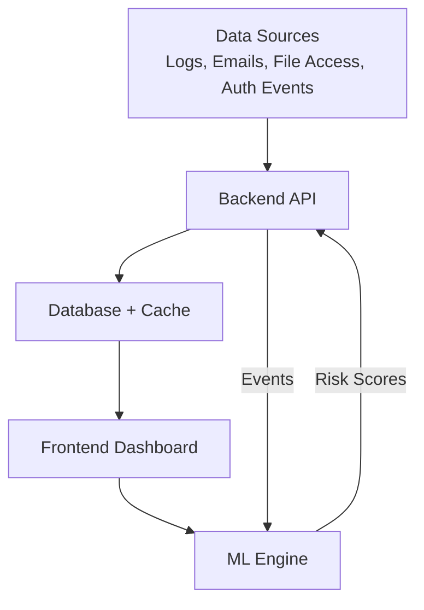

🛡️ Insider Threat Detection System

An end-to-end Insider Threat Detection System designed to identify, analyze, and respond to malicious or risky activities performed by internal users within an organization.

This project focuses on behavioral analysis, risk scoring, and alert generation by correlating events across multiple internal data sources.

📌 Problem Statement

Insider threats are among the most difficult security challenges because they originate from authorized users. Traditional perimeter security systems often fail to detect:

* Privilege misuse
* Data exfiltration by employees
* Policy violations
* Anomalous behavior that appears legitimate

This system aims to detect such threats early using behavior baselining, rule-based logic, and machine learning.

🎯 Project Objectives

* Collect and normalize internal activity events
* Build behavioral baselines for users
* Detect anomalies and policy violations
* Assign risk scores to users and events
* Generate actionable alerts and cases
* Provide a centralized dashboard for analysts

🏗️ High-Level Architecture

🧩 Project Structure

## 📁 Project Architecture

```mermaid
flowchart TB
    ROOT[insider-threat-detection]

    ROOT --> BACKEND[backend]
    ROOT --> FRONTEND[frontend]
    ROOT --> ML[ml]
    ROOT --> INFRA[infra]
    ROOT --> DOCS[docs]
    ROOT --> CONFIG[config files]

    BACKEND --> B1[API Controllers]
    BACKEND --> B2[Services]
    BACKEND --> B3[Repositories]
    BACKEND --> B4[Models]
    BACKEND --> B5[Jobs & Workers]

    FRONTEND --> F1[Pages]
    FRONTEND --> F2[Components]
    FRONTEND --> F3[Services]
    FRONTEND --> F4[Store]
    FRONTEND --> F5[Styles]

    ML --> M1[Data]
    ML --> M2[Feature Engineering]
    ML --> M3[Training]
    ML --> M4[Inference]

    INFRA --> I1[Docker]
    INFRA --> I2[Nginx]
    INFRA --> I3[Kubernetes]
    INFRA --> I4[Terraform]

    DOCS --> D1[Architecture]
    DOCS --> D2[API Docs]
    DOCS --> D3[ML Notes]
    DOCS --> D4[Deployment Guide]

    CONFIG --> C1[README.md]
    CONFIG --> C2[docker-compose.yml]
    CONFIG --> C3[.env.example]
```

🧠 Backend (Node.js / Express)

Responsibilities
* Event ingestion APIs
* Authentication & RBAC
* Behavioral analysis services
* Risk scoring engine
* Alert & case management

Key Concepts
* Controller → Service → Repository pattern
* Asynchronous processing using queues
* Modular and testable architecture

🎨 Frontend (React + Vite)

Responsibilities
* Analyst dashboard
* Alert & case visualization
* Risk analytics
* User activity exploration

Design Goals
* Clear information hierarchy
* Minimal cognitive load for analysts
* Real-time updates via WebSockets

🤖 Machine Learning (Python)

Planned Capabilities
* Feature extraction from event streams
* User behavior modeling
* Anomaly detection
* Risk score prediction

Approach
* Start with rule-based + statistical models
* Gradually integrate ML models
* Keep ML services decoupled from backend

🧪 Development Status

✅ Backend architecture scaffold
✅ Frontend architecture scaffold
⬜ ML pipeline scaffold
⬜ Documentation expansion
⬜ Backend API implementation
⬜ Frontend UI implementation

🚀 Tech Stack (Planned)

Backend
* Node.js
* Express
* PostgreSQL
* Redis
* Docker

Frontend
* React
* Vite
* CSS / Tailwind (TBD)

ML
* Python
* scikit-learn / PyTorch (TBD)

Infra
* Docker
* Nginx
* Kubernetes (future)

🔒 Security Considerations

* Role-based access control (RBAC)
* Audit logging
* Data masking for sensitive fields
* Secure authentication flows

📈 Future Enhancements

* MITRE ATT&CK mapping
* UEBA (User & Entity Behavior Analytics)
* SOAR integrations
* Threat intelligence enrichment
* Automated response actions

🧑‍💻 Author

* Built as a learning-oriented yet production-grade project to deeply understand:
* System design
* Security analytics
* Backend architecture
* End-to-end engineering workflows

📄 License

This project is currently for educational and experimental purposes.
